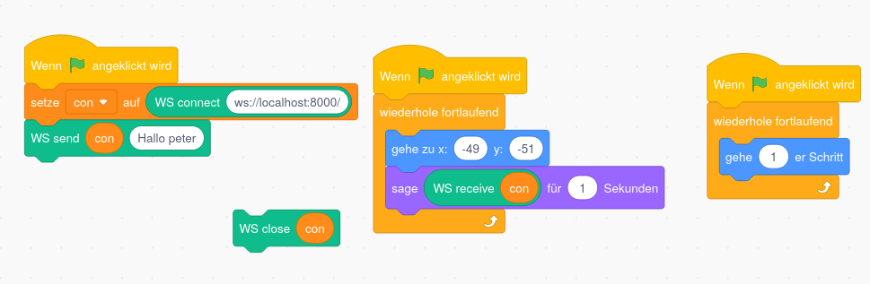

# scratch_websocket
websocket access for scratch 3.0

## What is it:
Its a simple javascript file adding a web-socket extention to scratch. This way its possible to interact with web-socket anywhere on the world and especiliy on the localhost.

## Link to test this:
https://sheeptester.github.io/scratch-gui/?url=https://janwilleke.github.io/scratch_websocket/websock.js

## How to use:

First a variabel to reference a connection is created.
This way multible connection the same time are possible.

## Limitations:

The back channel is not working at all ;-(.
A way to do async messages is still be needed. 
At the moment recieved messages are printed to the console.
